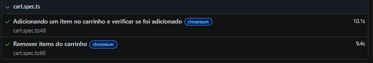
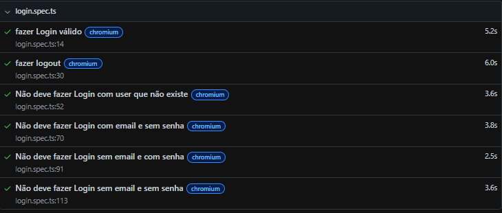
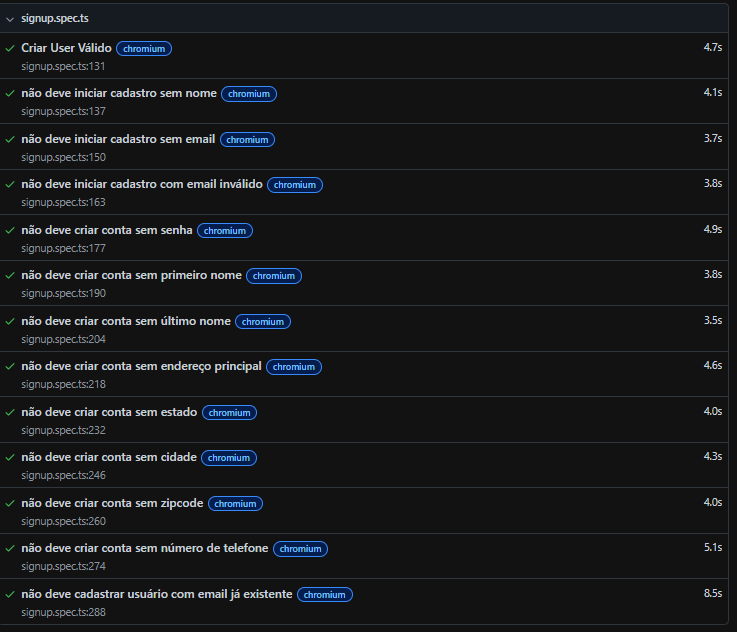

# Testes Automatizados - Automation Exercise

Projeto de automação de testes E2E desenvolvido para estudos de QA Automation utilizando Playwright e TypeScript no site automationexercise.com.
# Stack
  


## Objetivo

Este projeto foi criado com o objetivo de praticar automação de testes End-to-End (E2E), aplicando conceitos de QA Automation como:

- Criação de cenários automatizados
- Validações de interface
- Testes funcionais

---

## Como executar


### Clonar o projeto

```bash
git clone https://github.com/Hugonogo/Testes-automatizados-automationexercise.com
```

### Instalar dependências

```bash
npm install
```
### Executar testes
```bash
npx playwright test
```
### Abrir relatório HTML
```bash
npx playwright show-report
```
## Cenários Automatizados

### Carrinho

- Adicionar item ao carrinho e validar se foi adicionado
- Remover itens do carrinho



---

### Login

- Fazer login válido
- Fazer logout
- Não deve fazer login com usuário inexistente
- Não deve fazer login com email e sem senha
- Não deve fazer login sem email e com senha
- Não deve fazer login sem email e sem senha



---

### Cadastro de Usuário

- Criar usuário válido
- Não deve iniciar cadastro sem nome
- Não deve iniciar cadastro sem email
- Não deve iniciar cadastro com email inválido
- Não deve criar conta sem senha
- Não deve criar conta sem primeiro nome
- Não deve criar conta sem último nome
- Não deve criar conta sem endereço principal
- Não deve criar conta sem estado
- Não deve criar conta sem cidade
- Não deve criar conta sem zipcode
- Não deve criar conta sem número de telefone
- Não deve cadastrar usuário com email já existente



---

## Aprendizados

Durante o desenvolvimento deste projeto foi possível praticar:

- Automação E2E
- Estruturação de testes
- Uso do Playwright
- Manipulação de elementos
- Esperas explícitas
- Geração de dados dinâmicos
- Organização de código em TypeScript
